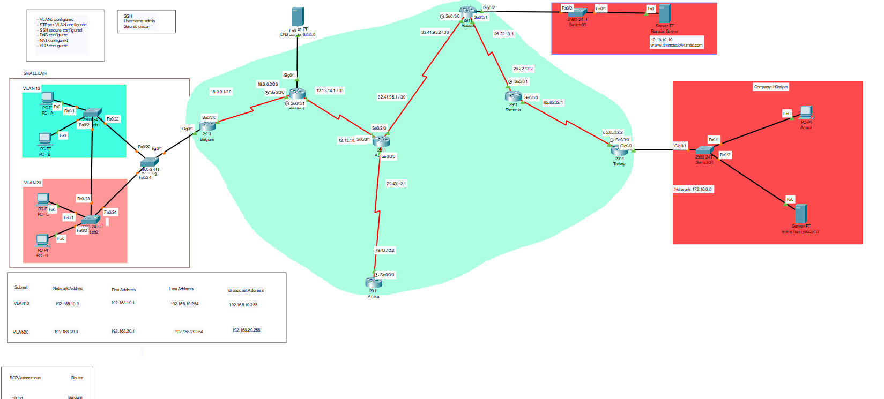

# Networking Packet Tracer

### [Working of the Internet](https://github.com/UmutErgunes/Networking-Security/blob/master/Networking%20-%20Cisco/Lan-Wan-DNS-Internet.pkt) 
#### After going in this link, click the 'download' button to download it.

#### BGP
In this packet tracer I created a simple WAN or in other words the "internet".
In our daily life without us being aware there are still routers being configured with BGP (Border Gateway Protocol). By using this protocol our 'Network' expands, so the internet.
#### DNS
By adding DNS server I have shown an example here how the DNS providers actually work.

#### VLAN
There is hardly any LAN that does not use a VLAN. Almost all companies use VLAN for different departments in their company. In this packet tracer I kept it simple and created 2 VLAN.

Subnet:
  - The network address of VLAN10: 192.168.10.0
  - The network address of VLAN20 : 192.168.20.0
  
  
#### STP
I also configured STP to avoid loops between Switches

#### TACACS+
I configured TACACS+ server at 1 LAN (Africa). I think TACACS+ is better than Radius, because at TACACS+ the entire packages are encrypted while at RADIUS, only the password is encrypted. Therefore TACACS+ is better.

